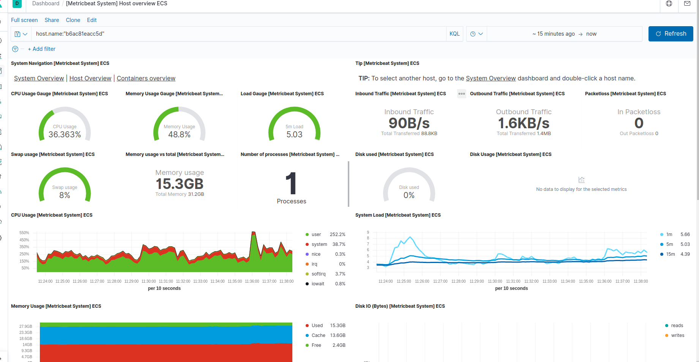
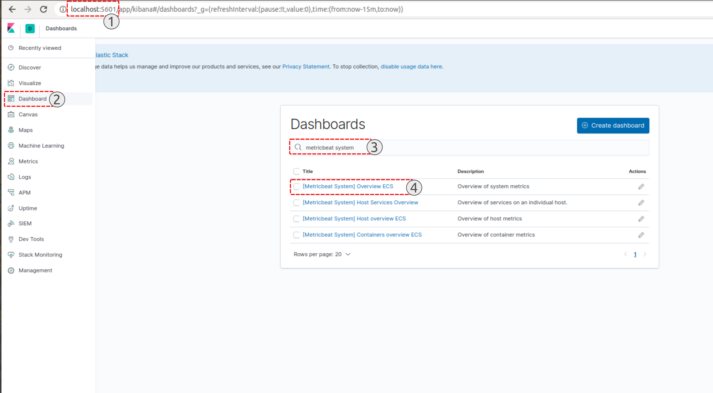

# Elastic-Stack-Metricbeat

In this repository, you can see the instructions to create a full ELK Stack Elastic entry with ElasticSearch, metricbeat and kibana. To mount a monitoring environment on servers. All done in a simple way using docker and shared volumes.



## Instructions:

###  Requirement

It is necessary to have installed in your operating system:
1. Docker [https://docs.docker.com/docker-for-windows/install/]
2. Docker-compose [https://docs.docker.com/compose/install/]


### 1. Build services using docker-compose

You can build the environment using the docker-compose commands

```
docker-compose up -d

```

### 2. Verify that all services are executed

```
docker ps 
```

Results:

```
CONTAINER ID        IMAGE                                                 COMMAND                  CREATED              STATUS              PORTS                                            NAMES
728c514c6486        docker.elastic.co/beats/metricbeat:7.6.2              "/usr/local/bin/dock…"   57 seconds ago       Up 32 seconds                                                        metricbeat
4cee9956dedf        docker.elastic.co/beats/metricbeat:7.6.2              "/usr/local/bin/dock…"   57 seconds ago       Up 56 seconds                                                        filebeat
6ffeacd38cda        docker.elastic.co/logstash/logstash:7.6.2             "/usr/local/bin/dock…"   About a minute ago   Up About a minute   0.0.0.0:5044->5044/tcp, 0.0.0.0:9600->9600/tcp   logstash
fdd61565adbe        docker.elastic.co/elasticsearch/elasticsearch:7.6.2   "/usr/local/bin/dock…"   About a minute ago   Up About a minute   0.0.0.0:9200->9200/tcp, 9300/tcp                 elasticsearch
00bc5e77e884        docker.elastic.co/kibana/kibana:7.6.2                 "/usr/local/bin/dumb…"   About a minute ago   Up About a minute   0.0.0.0:5601->5601/tcp                           kibana
```

### 3. Search dashboard

1 . Open Kibana:  http://localhost:5601
2 . Click in Dashboard Opcion 
3 . Write (meatric system)
4 . Open dashboard


